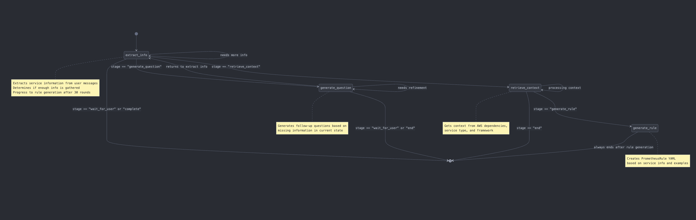

# LangGraph Workflow for Prometheus Rule Generation

This diagram visualizes the LangGraph workflow for generating Prometheus rules. Here's how it works:

1. The workflow starts at the `extract_info` node, which processes user input to gather service information
2. Based on the current state, it routes to:
  * Back to `extract_info` if more information processing is needed
  * To `generate_question` if a follow-up question is needed
  * To `retrieve_context` when enough information is gathered
  * End if waiting for user input or complete
3. The `generate_question` node creates follow-up questions and can:
  * Return to `extract_info` for further processing
  * Loop back to itself for refinement
  * End when waiting for user input
4. The `retrieve_context` node gets relevant information based on service details and can:
  * Loop to process more context
  * Progress to `generate_rule` when context is ready
  * End if needed
5. The `generate_rule` node creates the final PrometheusRule YAML and always ends the workflow

The routing between nodes is determined by the `router` function which examines the current stage in the state.

## State Schema

The schema contains these fields:

1. `service_info`: A dictionary containing service information (functionality, owner, service name, type, etc.)
2. `context`: A list of strings with reference examples for PrometheusRules
3. `prometheus_rule`: An optional string containing the generated YAML rule
4. `stage`: A string indicating the current workflow stage (default: "extract_info")
5. `attempt_count`: An integer tracking conversation turns (for limiting iterations)
6. `next_question`: An optional string containing the next question to ask
7. `retrieved_docs`: A list of Document objects from retrieval

Since it extends `MessagesState`, it also inherits the message history functionality that stores the conversation between the agent and the user.

The workflow uses this schema to maintain state as it progresses through the nodes in the graph, with each node updating various parts of the state.